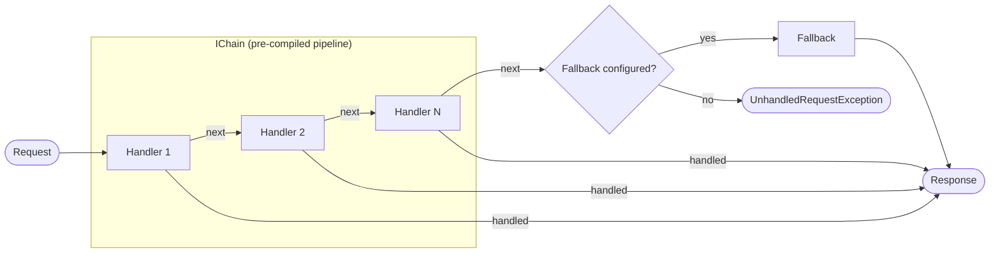

# Message-Flow

A small, dependency-free **Chain of Responsibility** library for **C#, Java, Python and Node**.

`MessageFlow` lets you compose an ordered set of handlers into an immutable chain. A request travels
through the chain until a handler accepts it; unhandled requests either hit a configured fallback or
raise `UnhandledRequestException`. The pipeline is composed once at build time, so executing a
request is just a delegate invocation.

Every port exposes the same concepts and the same composition rules, so a pipeline designed in one
language can be transcribed into any other one. Try them out in the
[**playground**](https://charles2ke.github.io/Message-Flow/), where the API is served by the
JavaScript port running in your browser.

[](https://www.nuget.org/packages/MessageFlow)
[](https://central.sonatype.com/artifact/io.github.messageflow/messageflow)
[](https://pypi.org/project/messageflow/)
[](https://www.npmjs.com/package/messageflow)
[](LICENSE)

<!-- BEGIN AUTO-GENERATED: coverage -->


<!-- END AUTO-GENERATED: coverage -->

## How it works

A request enters the chain and is offered to each handler in registration order. The first handler
that accepts it produces the response; middleware-style handlers can also run code after the rest of
the chain returns. If no handler accepts the request, the configured fallback runs — or
`UnhandledRequestException` is thrown when there is none.



## Features

- Async-first API built on `ValueTask`, with full `CancellationToken` propagation.
- Immutable, pre-compiled pipelines — no per-request allocation for chain traversal.
- Three ways to add a link: an `IHandler<,>` implementation, the `HandlerBase<,>` convenience class,
  or an inline lambda.
- Middleware-style handlers can run code before *and* after the rest of the chain.
- Nested branches via `UseBranch`, with automatic fall-through back to the parent chain.
- Merging of separately authored chain fragments — or already built chains — via `Use`.
- Optional fallback for unhandled requests.
- Opt-in observability: `UseLogging` for structured log entries and `UseTracing` for
  `System.Diagnostics.Activity` traces — no third-party dependency required.

## Installation

The C# library targets `net8.0`. Install it from NuGet:

```bash
dotnet add package MessageFlow
```

To build from source instead, clone the repository and add a project reference:

```bash
dotnet add reference src/MessageFlow/MessageFlow.csproj
```

The other ports are installed with their own package manager:

| Language | Package | Install | Documentation |
| --- | --- | --- | --- |
| C# (.NET 8) | `MessageFlow` | `dotnet add package MessageFlow` | this file |
| Java 17 | `io.github.messageflow:messageflow` | Maven or Gradle dependency | [`java`](java/README.md) |
| Python 3.9+ | `messageflow` | `pip install messageflow` | [`python`](python/README.md) |
| Node 20+ | `messageflow` | `npm install messageflow` | [`node`](node/README.md) |

The ports mirror this API, adapted to the idioms of their language: `ValueTask` in C#,
`CompletionStage` in Java, `async`/`await` coroutines in Python and `Promise` in TypeScript. Each
port README documents the differences.

## Playground

<https://charles2ke.github.io/Message-Flow/> lists the four ports and embeds a Swagger UI for a small
API built on the library — listing the supported languages, describing the ticket triage chain,
executing it and composing an ad-hoc chain from a JSON description. The endpoints are answered inside
the page by the JavaScript port, so *Try it out* composes and runs a real chain and nothing is sent
over the network. The API description lives in [`docs/public/openapi.yaml`](docs/public/openapi.yaml)
and the site is built and deployed by [`.github/workflows/pages.yml`](.github/workflows/pages.yml);
see [`docs`](docs/README.md) to run it locally.

## Quick start

The examples below use C#; the [Java](java/README.md), [Python](python/README.md) and
[Node](node/README.md) READMEs show the same pipelines in their own syntax.

```csharp
using MessageFlow;

var chain = Chain.Create<int, string>()
    .UseWhen(request => request < 0, (request, _) => new ValueTask<string>($"negative:{request}"))
    .UseWhen(request => request == 0, (_, _) => new ValueTask<string>("zero"))
    .WithFallback((request, _) => new ValueTask<string>($"positive:{request}"))
    .Build();

string response = await chain.ExecuteAsync(-7); // "negative:-7"
```

### Reusable handlers

```csharp
public sealed class RefundHandler : HandlerBase<Ticket, string>
{
    protected override bool CanHandle(Ticket ticket) => ticket.Kind == TicketKind.Refund;

    protected override ValueTask<string> ProcessAsync(Ticket ticket, CancellationToken cancellationToken)
        => new($"refund issued for {ticket.Id}");
}

var chain = Chain.Create<Ticket, string>()
    .Use(new RefundHandler())
    .Use(new EscalationHandler())
    .Build(); // throws UnhandledRequestException when nothing handles the ticket
```

### Middleware-style handlers

An inline handler receives the next step of the chain, so it can wrap the remainder — useful for
logging, timing or result post-processing:

```csharp
var chain = Chain.Create<string, string>()
    .Use(async (request, next, cancellationToken) =>
    {
        var response = await next(request, cancellationToken);
        return response.ToUpperInvariant();
    })
    .WithFallback((request, _) => new ValueTask<string>(request))
    .Build();
```

### Branching

`UseBranch` nests a sub-chain that only runs when the predicate matches. When the predicate does not
match, the request skips the branch; when it matches but no handler of the branch accepts the
request, the request falls through to the next handler of the parent chain:

```csharp
var chain = Chain.Create<Ticket, string>()
    .UseBranch(ticket => ticket.Kind == TicketKind.Billing, branch => branch
        .Use(new RefundHandler())
        .Use(new InvoiceHandler()))
    .Use(new EscalationHandler()) // reached by billing tickets the branch did not accept
    .WithFallback((ticket, _) => new ValueTask<string>($"queued:{ticket.Id}"))
    .Build();
```

Give the branch its own fallback to stop that fall-through and terminate inside the branch instead:

```csharp
.UseBranch(ticket => ticket.Kind == TicketKind.Billing, branch => branch
    .Use(new RefundHandler())
    .WithFallback((ticket, _) => new ValueTask<string>($"billing backlog:{ticket.Id}")))
```

The branch is composed at `Build()` time alongside the rest of the pipeline, so it costs a single
extra delegate call per request. A branch counts as one handler towards `IChain.Count`, no matter
how many handlers it contains.

### Merging chains

`Use` also accepts another `ChainBuilder<,>`, so chain fragments authored independently — by
different teams, modules or DI registrations — can be glued together. The merged handlers are
composed against the continuation of the parent chain, so requests they do not accept keep flowing:

```csharp
static ChainBuilder<Ticket, string> BillingFragment() => Chain.Create<Ticket, string>()
    .Use(new RefundHandler())
    .Use(new InvoiceHandler());

var chain = Chain.Create<Ticket, string>()
    .Use(BillingFragment())
    .Use(new EscalationHandler()) // reached by tickets the fragment did not accept
    .WithFallback((ticket, _) => new ValueTask<string>($"queued:{ticket.Id}"))
    .Build();
```

An already built chain can be merged the same way:

```csharp
IChain<Ticket, string> billing = BillingFragment().Build();

var chain = Chain.Create<Ticket, string>()
    .Use(billing)
    .Use(new EscalationHandler())
    .Build();
```

Chains built by `Build()` are re-composed into the parent, so an unhandled request falls through
instead of throwing `UnhandledRequestException` — no exceptions are used for control flow. A custom
`IChain<,>` implementation cannot be re-composed, so it is executed as-is and terminates the chain.

Two rules are worth remembering:

- **Fallback precedence** — if the merged fragment configures its own `WithFallback`, that fallback
  becomes the terminal step of the merged segment and the remaining handlers of the parent chain are
  never reached. This matches `UseBranch`.
- **Count** — a merged fragment counts as one handler towards `IChain.Count`, no matter how many
  handlers it contains.

Merging a builder snapshots its handlers, so later changes to the fragment do not affect chains it
was already merged into, the same fragment can be merged into several chains, and merging a builder
into itself is safe.

### Logging and tracing

`UseLogging` and `UseTracing` are middleware-style handlers that observe everything registered after
them, so registering them first observes the whole chain.

`UseLogging` writes one entry when a request enters the chain, one when it completes — including the
elapsed time — and one at `ChainLogLevel.Error` when the chain throws, before rethrowing the
exception unchanged. Only type names and durations are logged, never the request itself, so payloads
cannot leak into log storage. The `IChainLogger` abstraction keeps the library dependency-free; an
adapter over `Microsoft.Extensions.Logging.ILogger` — or any other logging framework — is a few
lines of code:

```csharp
public sealed class ChainLoggerAdapter(ILogger logger) : IChainLogger
{
    public bool IsEnabled(ChainLogLevel level) => logger.IsEnabled(Map(level));

    public void Log(ChainLogLevel level, string message, Exception? exception)
        => logger.Log(Map(level), exception, "{Message}", message);

    private static LogLevel Map(ChainLogLevel level) => level switch
    {
        ChainLogLevel.Trace => LogLevel.Trace,
        ChainLogLevel.Debug => LogLevel.Debug,
        ChainLogLevel.Information => LogLevel.Information,
        ChainLogLevel.Warning => LogLevel.Warning,
        _ => LogLevel.Error,
    };
}
```

`UseTracing` wraps the remainder of the chain in an `Activity` emitted on
`ChainDiagnostics.ActivitySource`. The activity is only created when a listener is subscribed, so an
unobserved chain costs a single delegate call. Failures set the activity status to `Error` and record
an exception event:

```csharp
var chain = Chain.Create<Ticket, string>()
    .UseLogging(logger, ChainLogLevel.Information)
    .UseTracing()
    .Use(new RefundHandler())
    .WithFallback((ticket, _) => new ValueTask<string>($"queued:{ticket.Id}"))
    .Build();
```

Collect the traces with OpenTelemetry by subscribing to the activity source:

```csharp
tracerProviderBuilder.AddSource(ChainDiagnostics.ActivitySourceName);
```

## Samples

The [`samples/MessageFlow.Samples`](samples/MessageFlow.Samples/README.md) project contains runnable
examples for quick start routing, `HandlerBase<,>` handlers, merged chain fragments, middleware,
fallbacks, cancellation, logging and tracing, and a custom retry handler:

```bash
dotnet run --project samples/MessageFlow.Samples/MessageFlow.Samples.csproj
```

## Public API (C#)

<!-- BEGIN AUTO-GENERATED: api -->
| Type | Kind | Description |
| --- | --- | --- |
| `Chain&lt;TRequest, TResponse&gt;` | class | Default IChain&lt;TRequest, TResponse&gt; implementation. The handler pipeline is composed once, at build time, so execution is a simple delegate call. |
| `ChainBuilder&lt;TRequest, TResponse&gt;` | class | Builds an immutable IChain&lt;TRequest, TResponse&gt; from an ordered set of handlers. |
| `ChainBuilderDiagnosticsExtensions` | class | Adds logging and tracing middleware to a ChainBuilder&lt;TRequest, TResponse&gt;. |
| `ChainDiagnostics` | class | The diagnostic primitives the library exposes to tracing infrastructure such as OpenTelemetry. |
| `Chain` | class | Entry point for creating chains of responsibility. |
| `ChainLogLevel` | enum | The severity of an entry written by a chain to an IChainLogger. |
| `HandlerBase&lt;TRequest, TResponse&gt;` | class | Convenience base class for handlers that either fully handle a request or pass it on. |
| `IChain&lt;TRequest, TResponse&gt;` | interface | An immutable, pre-compiled chain of responsibility. |
| `IChainLogger` | interface | Receives the log entries a chain writes while executing a request. |
| `IHandler&lt;TRequest, TResponse&gt;` | interface | A single link of a chain of responsibility. |
| `NextHandler&lt;TRequest, TResponse&gt;` | delegate | Represents the next step of a chain of responsibility. |
| `UnhandledRequestException` | class | Thrown when no handler of a chain accepted the request and no fallback was configured. |
<!-- END AUTO-GENERATED: api -->

## Repository layout

| Path | Description |
| --- | --- |
| `src/MessageFlow` | The C# library. |
| `java` | The Java port of the library, see [java](java/README.md). |
| `python` | The Python port of the library, see [python](python/README.md). |
| `node` | The Node/TypeScript port of the library, see [node](node/README.md). |
| `docs` | The GitHub Pages site and the Swagger UI playground, see [docs](docs/README.md). |
| `samples/MessageFlow.Samples` | Runnable examples, see [samples/MessageFlow.Samples](samples/MessageFlow.Samples/README.md). |
| `tests/MessageFlow.Tests` | xUnit tests, gated at 100% line, branch and method coverage. |
| `benchmarks/MessageFlow.Benchmarks` | BenchmarkDotNet performance benchmarks. |
| `scripts/update_readme.py` | Regenerates the auto-generated README sections. |

## Build, test and coverage

```bash
dotnet build MessageFlow.slnx
dotnet test tests/MessageFlow.Tests/MessageFlow.Tests.csproj \
  -p:CollectCoverage=true \
  -p:CoverletOutputFormat="cobertura%2cjson" \
  -p:Threshold=100 \
  -p:ThresholdType="line%2cbranch%2cmethod"
```

The build treats warnings (including .NET analyzer diagnostics) as errors, and the test run fails if
coverage drops below 100%.

The Java port is built and tested with Maven:

```bash
cd java
mvn verify
```

The Python port is installed in editable mode and tested with pytest, gated at 100% coverage:

```bash
cd python
pip install -e ".[dev]"
ruff check src tests
pytest --cov=messageflow --cov-report=term-missing --cov-fail-under=100
```

The Node port is compiled with the TypeScript compiler and tested with the built-in test runner:

```bash
cd node
npm ci
npm test
```

Each port has its own workflow — `.github/workflows/ci.yml`, `java-ci.yml`, `python-ci.yml` and
`node-ci.yml` — and the site is built on every pull request by `pages.yml`.

## Performance

```bash
dotnet run --project benchmarks/MessageFlow.Benchmarks/MessageFlow.Benchmarks.csproj -c Release -- --filter '*'
```

The benchmark compares the pre-compiled chain against a classic linked-list chain of responsibility
for chains of 1, 5 and 20 handlers, and reports allocations via `MemoryDiagnoser`. Benchmarks also run
in CI and their results are uploaded as a build artifact.

## Releases and versioning

The project follows [Semantic Versioning](https://semver.org/spec/v2.0.0.html); notable changes are
recorded in [CHANGELOG.md](CHANGELOG.md).

Pushing a `v*` tag runs `.github/workflows/release.yml`, which packs `src/MessageFlow` with the tag
version and pushes the package and symbols to NuGet. The Java artifact is published to Maven Central
from the `java` module with the `central` Maven profile:

```bash
cd java
mvn -P central deploy
```

The Python distribution is published to PyPI and the JavaScript package to npm from their own
directories:

```bash
cd python && python -m build && twine upload dist/*
cd node && npm publish
```

The documentation site is redeployed to GitHub Pages on every push to `main` by
`.github/workflows/pages.yml`.

## Security

Security scanning runs automatically on every push and pull request:

- **CodeQL** (`.github/workflows/codeql.yml`) with the `security-extended` query suite.
- **Dependency review** (`.github/workflows/dependency-review.yml`) on pull requests.
- **`dotnet list package --vulnerable --include-transitive`** in CI, which fails the build when a
  vulnerable NuGet package (direct or transitive) is detected.

## Auto-updated documentation

The coverage badges and public API table above are generated from the code and the coverage report.
`.github/workflows/update-readme.yml` regenerates them on every push to `main` and commits the
result; pull requests are checked with:

```bash
python scripts/update_readme.py --check
```

## License

Apache-2.0. See [LICENSE](LICENSE).
